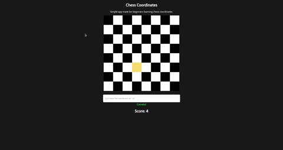

## Chess Notations
:pushpin:  A simple app made in **p5.js** for beginners to learn chess notations, also known as Algebraic Notations.

---

#### Quickstart 

Clone the repository, open the *"app"* folder and run the `index.html` file.

---

*"Unlike other games in which lucre is the end and aim, [chess] recommends itself to the wise by the fact that its mimic battles are fought for no prize but honor. It is eminently and emphatically the philosopher’s game".* - Paul Morphy

